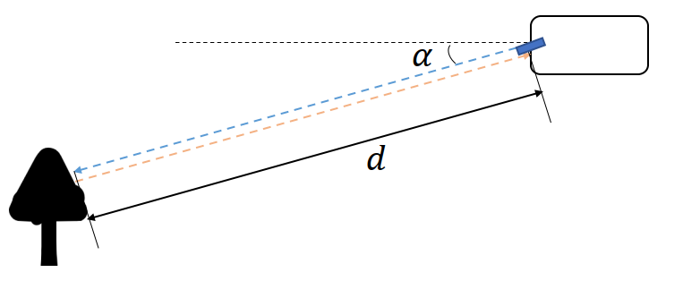
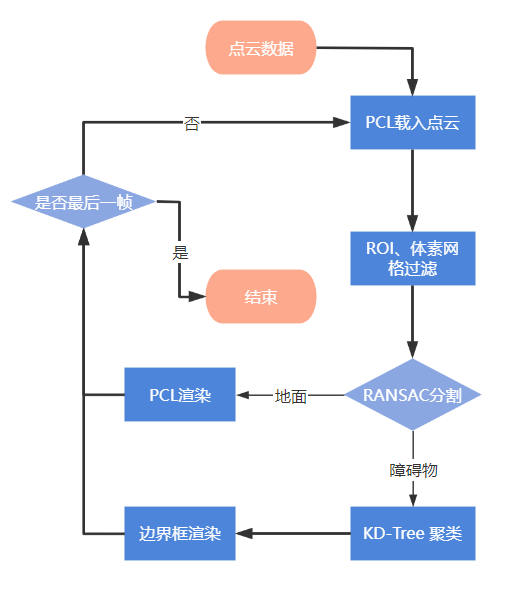

## 激光雷达障碍物检测

### 0. 储备知识

#### 0.1 激光雷达的成像机制



- ToF（Time of Flight）原理：发射和接收时间的时延为 $\Delta t$
  $$
  d = \frac{1}{2}C*\Delta t
  $$

- 由于知道精确的发射角，因此可以定位坐标

$$
\begin{vmatrix} x \\ y \end{vmatrix} = \begin{vmatrix} d*cos(\alpha) \\ d*sin(\alpha) \end{vmatrix}
$$

- 同理，可求得三维坐标$(x,y,z)$

- 对于每个激光束返回点，根据材质、颜色等，其返回的强度值（intensity）不同

- 激光雷达成像的点云中有如下指标，其中时间戳为发射时间和接收时间的中值
  $$
  \begin{cases} timestamp \\ (x,y,z) \\ intensity \end{cases}
  $$


#### 0.2 激光雷达的核心参数

| LIDAR参数  | 含义                               | 常见案例                               |
| ---------- | ---------------------------------- | -------------------------------------- |
| 线束       | 激光束个数                         | 64、32                                 |
| 旋转频率   | 一秒旋转次数                       | 10Hz、20Hz                             |
| 角分辨率   | 获得一次数据的旋转角度             | $0.08^{\omicron}$                      |
| 垂直视场角 | 其范围的大小(FOV)为$40^{\omicron}$ | $-25^{\omicron} $ 至 $+15^{\omicron} $ |
| 垂直分辨率 |                                    | $min 0.167^{\omicron}$                 |
| 点频       | 单位时间返回点数                   | 1152000 pt/s                           |

- 计算64线束、0.08的角分辨率、旋转频率10Hz的激光单位时间返回点数？
  $$
  64*\frac{360}{0.08}*10 = 2880000
  $$
  

#### 0.3 CMake - 模板

```cmake
# 指定cmake最低版本
cmake_minimum_required(VERSION 2.8 FATAL_ERROR)
# 指定项目名称
project(lidar_obstacle_detection)

# 给CXXFLAGS、CMAKE_CXX__FLAGS、CMAKE_CXX_STANDARD 赋值
set(CXX_FLAGS "-Wall")
set(CMAKE_CXX_FLAGS, "${CXX_FLAGS}")
set(CMAKE_CXX_STANDARD 14)

# 设定源码列表.cpp
set(SOURCE_FILES src/environment.cpp src/render/render.cpp src/processPointClouds.cpp)
# # 将${CMAKE_SOURCE_DIR}目录下所有的.cpp文件放入DIR变量中
# aux_source_directory(${CMAKE_SOURCE_DIR} SOURCE_FILES)

# 查找PCL库, 找到之后将其头文件、库文件路径赋值到 PCL_INCLUDE_DIRS、PCL_LIBRARY_DIRS
find_package(PCL REQUIRED)

# 加入头文件路径, include_directories(dir1 dir2 ...)
include_directories(${PCL_INCLUDE_DIRS})
# 链接静态库文件路径, link_directories(lib_1 lib_2 ...)
link_directories(${PCL_LIBRARY_DIRS})
message("link directories: ${PCL_LIBRARY_DIRS}")

# 增加宏定义
add_definitions(${PCL_DEFINITIONS})
list(REMOVE_ITEM PCL_LIBRARIES "vtkproj4")

# IF(GPU)
# #在命令行中使用cmake -DGPU，会进入这一行，C++代码中自动会有#define GPU
#   ADD_DEFINITIONS(-DGPU) #注意一定要有-D
# ENDIF(GPU)

#添加子目录,作用相当于进入子目录里面，展开子目录的CMakeLists.txt
#同时执行，子目录中的CMakeLists.txt一般是编译成一个库，作为一个模块
#在父目录中可以直接引用子目录生成的库
#add_subdirectory(math)
 
#生成动/静态库
#add_library(动/静态链接库名称  SHARED/STATIC(可选，默认STATIC)  源码列表)
#可以单独生成多个模块


# 根据源文件生成可执行程序environment
add_executable (environment ${SOURCE_FILES})

# 设置要链接的导入（动态）库, 编译选项中-l后的内容
target_link_libraries (environment ${PCL_LIBRARIES})
message("target link directories: ${PCL_LIBRARY}")
```

```bash
# How to run.
cd lidar_obstacle_detection
mkdir build && cd build

cmake ..
make
./environment
```


### 1. 项目背景

### 2. 任务介绍

在这个项目中，你将利用你所学到的处理点云的所有知识，并使用它来检测使用激光雷达的狭窄街道上的汽车和卡车。

你的目标是在这些汽车和路过的卡车周围装上边界框，这样你的系统就可以在以后的路径规划中使用这些信息，试图避免与这些障碍物发生任何碰撞。

你已经完成了整个激光雷达障碍物检测过程。你能够流回多个pcd文件并进行过滤、分割、聚类和边界框检测。现在，你已经能够在单帧中检测障碍物，你可以通过跟踪帧的历史检测，使你的管道更加强大。你可以在帧中的检测之间建立关联，并利用它来跟踪物体。

在两个不同的帧之间建立关联的一种方法是通过两个检测之间的接近程度和它们看起来的相似程度。你还可以探索更多的过滤程序，例如在考虑之前查看连续帧中看到的检测。你还可以根据边界盒、它们的体积和形状进行过滤。通过部署跟踪方法和关联，你可以尝试动态地建立障碍物的形状。这方面的例子可能是，也许你看到一辆长卡车的背面，激光雷达首先看到的是卡车的背面。然后你开车经过卡车，让激光雷达看到卡车的侧面。有很多方法可以不断探索，使检测过程更加强大。

### 3. 项目流程



### 4. 算法实现

#### 4.1 载入点云

首选流式载入激光点云数据，即根据存放点云的目录得到pcd文件名列表

```c++
// 将目录转换成文件路径列表
// 参数：存放Pcd的文件目录
// 返回：存放Pcd文件名路径的列表
template<typename PointT>
std::vector<boost::filesystem::path> ProcessPointClouds<PointT>::streamPcd(std::string dataPath)
{
    boost::filesystem::directory_iterator startIter(dataPath);
    boost::filesystem::directory_iterator endIter;
    std::vector<boost::filesystem::path> paths(startIter, endIter);
    sort(paths.begin(), paths.end());

    return paths;
}
```

通过pcd文件名获得点云对象指针`pcl::PointCloud<PointT>::Ptr`

```c++
// 加载Pcd数据
// 参数：文件名
// 返回：存储点云数据的指针
template<typename PointT>
typename pcl::PointCloud<PointT>::Ptr ProcessPointClouds<PointT>::loadPcd(std::string file)
{

    typename pcl::PointCloud<PointT>::Ptr cloud (new pcl::PointCloud<PointT>);

    if (pcl::io::loadPCDFile<PointT> (file, *cloud) == -1) //* load the file
    {
        PCL_ERROR ("Couldn't read file \n");
    }
    std::cerr << "Loaded " << cloud->points.size () << " data points from "+file << std::endl;

    return cloud;
}
```


#### 4.2 过滤点云

（1）**体素网格**对点云数据降采样（计算质心）过滤，减少点云数量。超参数**体素大小**应该足够大，以帮助加快处理速度，但又不能大到完全失去对象的定义。

（2）定义**感兴趣区域ROI**（长方体）, 并删除感兴趣区域外的点。感兴趣区域的选择两侧需要尽量覆盖车道的宽度, 而前后的区域要保证你可以及时检测到前后车辆的移动。

（4）使用`pcl CropBox` 查找自身车辆车顶的点云数据索引, 然后将这些索引提供给 `pcl ExtractIndices` 对象删除, 因为这些对于我们分析点云数据没有用处

```c++
// 通过体素网格和感兴趣区域(ROI)过滤点云
// 参数：
//      - cloud: 输入点云
//      - filterRes: 体素网格的大小
//      - minPoint: ROI的最小点
//      - maxPoint: ROI的最大点
template<typename PointT>
typename pcl::PointCloud<PointT>::Ptr ProcessPointClouds<PointT>::FilterCloud(typename pcl::PointCloud<PointT>::Ptr cloud, float filterRes, Eigen::Vector4f minPoint, Eigen::Vector4f maxPoint)
{

    // 点云过滤开始时间
    auto startTime = std::chrono::steady_clock::now();

    // 存放体素网格过滤后点云对象
    typename pcl::PointCloud<PointT>::Ptr cloudFiltered (new pcl::PointCloud<PointT>);

    // 使用filterRes的体素网格大小对数据集进行降采样过滤处理
    pcl::VoxelGrid<PointT> vg; // 创建过滤对象：
    vg.setInputCloud(cloud);
    vg.setLeafSize(filterRes, filterRes, filterRes);
    vg.filter(*cloudFiltered);


    // 存放ROI过滤后点云对象
    typename pcl::PointCloud<PointT>::Ptr cloudRegion (new pcl::PointCloud<PointT>);

    pcl::CropBox<PointT> region(true);  // ROI滤波器对象
    region.setMin(minPoint);            // minPoint：立方体最小对角点, 一般为(x,y,z,1)
    region.setMax(maxPoint);            // maxPoint：立方体最大对角点，(x,y,z,1)最后一个元素一般为1
    region.setInputCloud(cloudFiltered);
    region.filter(*cloudRegion);

    std::vector<int> indices;           // 查找自身车辆车顶的点云数据索引

    pcl::CropBox<PointT> roof(true);    // 自身车辆ROI滤波对象
    roof.setMin(Eigen::Vector4f (-1.5, -1.7, -1, 1));
    roof.setMax(Eigen::Vector4f (2.6, 1.7, -0.4, 1));
    roof.setInputCloud(cloudRegion);
    roof.filter(indices);

    pcl::PointIndices::Ptr inliers {new pcl::PointIndices};
    for(int point: indices)
    {
        inliers->indices.push_back(point);
    }

    pcl::ExtractIndices<PointT> extract;    // 点云提取对象
    extract.setInputCloud (cloudRegion); 
    extract.setIndices (inliers);
    extract.setNegative (true);             // 将inliers过滤掉
    extract.filter (*cloudRegion);

    auto endTime = std::chrono::steady_clock::now();
    auto elapsedTime = std::chrono::duration_cast<std::chrono::milliseconds>(endTime - startTime);
    std::cout << "filtering took " << elapsedTime.count() << " milliseconds" << std::endl;

    return cloudRegion;
}
```


#### 4.3 基于RANSAC的点云分割

（1）点云分割的任务是将属于道路的点和属于场景的点分开，下面用pcl中随机采样一致（RANSAC，Random sample consensus）方法进行点云分割, 得到道路点和场景点

```c++
// 根据道路平面点云索引, 分别提取平面点云和障碍物点云
// 参数：
//      - inliers：道路点云索引
//      - cloud：需要分割的点云
// 返回：
//      - (地面点云, 障碍物点云)
template<typename PointT>
std::pair<typename pcl::PointCloud<PointT>::Ptr, typename pcl::PointCloud<PointT>::Ptr> ProcessPointClouds<PointT>::SeparateClouds(pcl::PointIndices::Ptr inliers, typename pcl::PointCloud<PointT>::Ptr cloud) 
{
    // 创建障碍物点云
    typename pcl::PointCloud<PointT>::Ptr obstCloud (new pcl::PointCloud<PointT> ());
    // 创建平面点云
    typename pcl::PointCloud<PointT>::Ptr planeCloud (new pcl::PointCloud<PointT> ());

    for (int index: inliers->indices)
    {
        planeCloud->points.push_back(cloud->points[index]);
    }

    pcl::ExtractIndices<PointT> extract; // 点云提取对象
    extract.setInputCloud (cloud);      
    extract.setIndices (inliers);
    extract.setNegative (true);          // 提取非inliers部分点云
    extract.filter (*obstCloud);         // 存在障碍物点云中

    
    std::pair<typename pcl::PointCloud<PointT>::Ptr, typename pcl::PointCloud<PointT>::Ptr> segResult(obstCloud, planeCloud);

    return segResult;
}

// 用pcl中RANSAC方法进行点云分割, 得到道路点和场景点
// 参数：
//      - cloud：需要分割的点云
//      - int maxIterations：最大迭代次数
//      - float distanceThreshold：查询点到目标模型的距离阈值
// 返回：
//      - (地面点云, 障碍物点云)
template<typename PointT>
std::pair<typename pcl::PointCloud<PointT>::Ptr, typename pcl::PointCloud<PointT>::Ptr> ProcessPointClouds<PointT>::SegmentPlane(typename pcl::PointCloud<PointT>::Ptr cloud, int maxIterations, float distanceThreshold)
{
    // 点云分割开始时间
    auto startTime = std::chrono::steady_clock::now();
    
    pcl::SACSegmentation<PointT> seg;                          // 分割类
    pcl::PointIndices::Ptr inliers {new pcl::PointIndices};    // 目标模型内联点,即地面
    pcl::ModelCoefficients::Ptr coefficients {new pcl::ModelCoefficients};  // 模型系数类

    seg.setOptimizeCoefficients(true);
    seg.setModelType(pcl::SACMODEL_PLANE);  // 设置提取目标模型的属性（平面、球、圆柱等）
    seg.setMethodType(pcl::SAC_RANSAC);     // 设置采样方法（RANSAC、LMedS等）
    seg.setMaxIterations(maxIterations);    // 设置最大迭代次数，默认为50
    // 查询点到目标模型的距离阈值（如果大于此阈值，则查询点不在目标模型上，默认为0）
    seg.setDistanceThreshold(distanceThreshold);

    // 从输入云中分割出最大的平面
    seg.setInputCloud(cloud);
    seg.segment(*inliers, *coefficients);
    if(inliers->indices.size() == 0)
    {
        std::cout << "Could not estimate a planar model for the given dataset" << std::endl;
    }

    // 点云分割结束时间
    auto endTime = std::chrono::steady_clock::now();
    auto elapsedTime = std::chrono::duration_cast<std::chrono::milliseconds>(endTime - startTime);
    std::cout << "plane segmentation took " << elapsedTime.count() << " milliseconds" << std::endl;

    // 将地面点云和障碍物点云分开
    std::pair<typename pcl::PointCloud<PointT>::Ptr, typename pcl::PointCloud<PointT>::Ptr> segResult = SeparateClouds(inliers,cloud);
    return segResult;
}

```

（2）[RANSAC](https://en.wikipedia.org/wiki/Random_sample_consensus)（RANdom SAmple Consensus，随机抽样一致性算法）是一种迭代方法， 常用来排除异常数据点（outliers）对模型的影响，RANSAC算法描述如下：

1. 从原始数据集中随机抽取一小部分（称为采样集），假设这部分数据都是正常的，用这部分数据训练模型。采样集的大小是能训练模型的最小样本数（这是个超参数，需要人为设置）

2. 用其他剩余样本测试上一步得到的模型。如果某个样本的损失小于某个阈值（这也是个超参数，需要人为设置），则认为它是和抽样出的样本是一致的，把它加入“一致集（Consensus Set）”中；若某个样本的损失大于阈值，则认为它是异常样本

3. 如果一致集的样本有足够多的样本，则认为该模型很好，拟合了大部分正常样本，如果一致集的样本较少，则丢弃这个模型

4. 然后，用一致集和采样集中的样本重新训练模型（如使用普通的最小二乘法），计算损失，如果整体损失比上次迭代小，则更新最佳拟合模型

5. 重复步骤1～4，直到一致集样本足够多或者达到最大的迭代次数，返回最佳拟合模型s

RANSAC算法的伪代码（摘自其 [Wikipedia](https://en.wikipedia.org/wiki/Random_sample_consensus#Algorithm)）：

```
Given:
    data – A set of observations.
    model – A model to explain observed data points.
    n – Minimum number of data points required to estimate model parameters.
    k – Maximum number of iterations allowed in the algorithm.
    t – Threshold value to determine data points that are fit well by model.
    d – Number of close data points required to assert that a model fits well to data.

Return:
    bestFit – model parameters which best fit the data (or null if no good model is found)

iterations = 0
bestFit = null
bestErr = something really large

while iterations < k do
    maybeInliers := n randomly selected values from data
    maybeModel := model parameters fitted to maybeInliers
    alsoInliers := empty set
    for every point in data not in maybeInliers do
        if point fits maybeModel with an error smaller than t
             add point to alsoInliers
        end if
    end for
    if the number of elements in alsoInliers is > d then
        // This implies that we may have found a good model
        // now test how good it is.
        betterModel := model parameters fitted to all points in maybeInliers and alsoInliers
        thisErr := a measure of how well betterModel fits these points
        if thisErr < bestErr then
            bestFit := betterModel
            bestErr := thisErr
        end if
    end if
    increment iterations
end while

return bestFit
```

（3）RANSAC拟合平面模型

1. 通过三点的平面方程式：
   $$
   Ax + By + Cz + D = 0
   $$
   对于

   - $point1 = (x_1,y_1,z_1)$
   - $point2 = (x_2,y_2,z_2)$
   - $point3 = (x_3,y_3,z_3)$

   以$point1$为参考定义两个矢量：

   - $v_1 = <x_2-x_1,y_2-y_1,z_2-z_1>$
   - $v_2=<x_3-x_1,y_3-y_1,z_3-z_1>$

   通过$v_1$和$v_2$的[向量积](https://zh.wikipedia.org/wiki/%E5%8F%89%E7%A7%AF)求平面的法向量：

   - $$
     v_1\times v_2 = <(y_2-y_1)(z_3-z_1)-(z_2-z_1)(y_3-y_1),(z_2-z_1)(x_3-x_1)-(x_2-x_1)(z_3-z_1),(x_2-x_1)(y_3-y_1)-(y_2-y_1)(x_3-x_1)>
     $$

   - 为简化令 $v_1 \times v_2 = <i,j,k>$

   - 那么
     $$
     i(x-x_1) + j(y-y_1) + k(z-z_1) = 0
     $$

     $$
     ix+jy+kz-(ix_1+jy_1+kz_1) = 0
     $$

     $$
     A = i,B = j, C = k, D = -(ix_1+jy_1+kz_1)
     $$

     

2. 点和平面之间的距离

   如果平面是：
   $$
   Ax + By + Cz + D = 0
   $$
   对于给定点$(x,y,z)$，那么点到面的距离为：
   $$
   d = \frac{|Ax + By + C*z + D|}{\sqrt{(A^2 + B^2 + C^2)}}
   $$

（4）平面模型的 RANSAC 算法实现

```c++
// 根据道路平面点云索引, 分别提取平面点云和障碍物点云
// 参数：
//      - inliers：道路点云索引
//      - cloud：需要分割的点云
// 返回：
//      - (地面点云, 障碍物点云)
template<typename PointT>
std::pair<typename pcl::PointCloud<PointT>::Ptr, typename pcl::PointCloud<PointT>::Ptr> ProcessPointClouds<PointT>::SeparateClouds(std::unordered_set<int> inliers, typename pcl::PointCloud<PointT>::Ptr cloud)
{
    // 创建障碍物点云
    typename pcl::PointCloud<PointT>::Ptr obstCloud (new pcl::PointCloud<PointT> ());
    // 创建平面点云
    typename pcl::PointCloud<PointT>::Ptr planeCloud (new pcl::PointCloud<PointT> ());

    for (int index = 0; index < cloud->points.size(); index ++)
    {
        if (inliers.count(index))
            planeCloud->points.push_back(cloud->points[index]);
        else
            obstCloud->points.push_back(cloud->points[index]);
    }
    
    std::pair<typename pcl::PointCloud<PointT>::Ptr, typename pcl::PointCloud<PointT>::Ptr> segResult(obstCloud, planeCloud);
    return segResult;
}


// 根据RANSAC算法求平面内联点
// 参数：
//		- cloud: 输入点云
//		- maxIterations: 算法最大迭代次数
//		- distanceTol: 距离阈值, 到平面的距离不大于阈值的点视为内联点
// 返回：(地面点云, 障碍物点云)
template<typename PointT>
std::pair<typename pcl::PointCloud<PointT>::Ptr, typename pcl::PointCloud<PointT>::Ptr> ProcessPointClouds<PointT>::RansacPlane(typename pcl::PointCloud<PointT>::Ptr cloud, int maxIterations, float distanceThreshold)
{
    std::unordered_set<int> inliersResult;
	srand(time(NULL));
	
	// 点云分割开始时间
    auto startTime = std::chrono::steady_clock::now();

	// 迭代 maxIterations 次
	while (maxIterations --)
	{
		std::unordered_set<int> inliers;
		// 随机抽样构成平面的最小点集
		while (inliers.size() < 3)
		{
			inliers.insert(rand() % cloud->points.size());
		}

		// 定义计算点到平面距离所需的变量
		float x1, y1, z1, x2, y2, z2, x3, y3, z3;
		auto itr = inliers.begin();
		x1 = cloud->points[*itr].x;
		y1 = cloud->points[*itr].y;
		z1 = cloud->points[*itr].z;
		itr ++;
		x2 = cloud->points[*itr].x;
		y2 = cloud->points[*itr].y;
		z2 = cloud->points[*itr].z;
		itr ++;
		x3 = cloud->points[*itr].x;
		y3 = cloud->points[*itr].y;
		z3 = cloud->points[*itr].z;

		float a, b, c, d;
		a = (y2 - y1)*(z3 - z1) - (z2 - z1)*(y3 - y1);
		b = (z2 - z1)*(x3 - x1) - (x2 - x1)*(z3 - z1);
		c = (x2 - x1)*(y3 - y1) - (y2 - y1)*(x3 - x1);
		d = -(a * x1 + b * y1 + c * z1);

        // 测量每个点和拟合平面之间的距离
		for (int i = 0; i < cloud->points.size(); i ++)
		{
			if (inliers.count(i)) continue;
			float x, y, z, distance;
			x = cloud->points[i].x;
			y = cloud->points[i].y;
			z = cloud->points[i].z;
			distance = fabs(a*x + b*y + c*z + d) / sqrt(a*a + b*b + c*c);

            // 如果距离小于阈值，把其当作内联点
			if (distance <= distanceThreshold) inliers.insert(i);
		}

        // 选择具有最多内联点的索引集合作为返回值
		if (inliers.size() > inliersResult.size())
			inliersResult = inliers;
	}
	// 点云分割结束时间
    auto endTime = std::chrono::steady_clock::now();
    auto elapsedTime = std::chrono::duration_cast<std::chrono::milliseconds>(endTime - startTime);
    std::cout << "my RansacPlane segmentation took " << elapsedTime.count() << " milliseconds" << std::endl;

    // 将地面点云和障碍物点云分开
    std::pair<typename pcl::PointCloud<PointT>::Ptr, typename pcl::PointCloud<PointT>::Ptr> segResult = SeparateClouds(inliersResult, cloud);
    return segResult;
}
```


#### 4.4 基于KD-Tree的点云聚类

（1）为何使用 KD-Tree？

聚类是指把不同物体的点云分别组合聚集起来, 从而能让你跟踪汽车, 行人等多个目标. 其中一种对点云数据进行分组和聚类的方法称为**欧氏聚类**. **欧式聚类**是指将距离紧密度高的点云聚合起来. 为了有效地进行最近邻搜索, 可以使用 KD-Tree 数据结构, 这种结构平均可以加快从 O (n)到 O (log (n))的查找时间.  这是因为`Kd-Tree`允许你更好地分割你的搜索空间.  通过将点分组到 KD-Tree 中的区域中, 您可以避免计算可能有数千个点的距离, 因为两个不是足够近的区域的点将不会被考虑.

（2）PCL 欧式聚类

首先我们使用PCL内置的欧式聚类函数. 点云聚类的具体细节推荐查看PCL的官网文档[Euclidean Cluster](http://link.zhihu.com/?target=http%3A//pointclouds.org/documentation/tutorials/cluster_extraction).

```c++
// 使用PCL内置的欧式聚类函数对障碍物点云进行聚类
// 参数：
//      - cloud：障碍物点云
//      - clusterTolerance：距离容忍度, 在这个距离之内的任何点都将被组合在一起
//      - minSize：设定一个集合中最小点数, 点数太小被视为噪音
//      - maxSize: 设定一个集合中最大点数, 点数太大被视为多个障碍物的重叠
template<typename PointT>
std::vector<typename pcl::PointCloud<PointT>::Ptr> ProcessPointClouds<PointT>::Clustering(typename pcl::PointCloud<PointT>::Ptr cloud, float clusterTolerance, int minSize, int maxSize)
{
    // 聚类开始时间
    auto startTime = std::chrono::steady_clock::now();

    // 返回值：聚类点云集合的列表
    std::vector<typename pcl::PointCloud<PointT>::Ptr> clusters;

    // 创建KdTree对象用于提取障碍物的搜索方法
    typename pcl::search::KdTree<PointT>::Ptr tree(new pcl::search::KdTree<PointT>);
    tree->setInputCloud(cloud);

    std::vector<pcl::PointIndices> clusterIndices;  // 创建索引对象列表存放提取障碍物索引
    pcl::EuclideanClusterExtraction<PointT> ec;     // 创建欧式聚类对象
    ec.setClusterTolerance(clusterTolerance);       // 设置距离容忍度
    ec.setMinClusterSize(minSize);                  // 设置最小点云数
    ec.setMaxClusterSize(maxSize);                  // 设置最大点云数
    ec.setSearchMethod(tree);                       // 设置KdTree的搜索方法
    ec.setInputCloud(cloud);                        // 设置输入点云
    ec.extract(clusterIndices);                     // 将聚类对象提取到clusterIndices

    // 根据索引对象得到聚类点云对象, 放入返回列表
    for (pcl::PointIndices getIndices: clusterIndices)
    {
        typename pcl::PointCloud<PointT>::Ptr cloudCluster (new pcl::PointCloud<PointT>);

        for (int index: getIndices.indices)
            cloudCluster->points.push_back(cloud->points[index]);

        cloudCluster->width = cloudCluster->points.size();
        cloudCluster->height = 1;
        cloudCluster->is_dense = true;

        clusters.push_back(cloudCluster);
    }

    // 聚类结束时间
    auto endTime = std::chrono::steady_clock::now();
    auto elapsedTime = std::chrono::duration_cast<std::chrono::milliseconds>(endTime - startTime);
    std::cout << "clustering took " << elapsedTime.count() << " milliseconds and found " << clusters.size() << " clusters" << std::endl;

    return clusters;
}
```


（3）KD-Tree 原理

https://leileiluoluo.com/posts/kdtree-algorithm-and-implementation.html

https://zhuanlan.zhihu.com/p/112246942

k-d tree即k-dimensional tree，常用来作空间划分及近邻搜索，是二叉空间划分树的一个特例。通常，对于维度为$k$，数据点数为$N$的数据集，k-d tree适用于$N>>2^k$的情形。

**算法原理：**k-d tree是每个节点均为k维数值点的二叉树，其上的每个节点代表一个超平面，该超平面垂直于当前划分维度的坐标轴，并在该维度上将空间划分为两部分，一部分在其左子树，另一部分在其右子树。即若当前节点的划分维度为d，其左子树上所有点在d维的坐标值均小于当前值，右子树上所有点在d维的坐标值均大于等于当前值，本定义对其任意子节点均成立。

**数据结构：**

```
struct kdtree{
    Node-data - 数据矢量   数据集中某个数据点，是n维矢量（这里也就是k维）
    Range     - 空间矢量   该节点所代表的空间范围
    split     - 整数       垂直于分割超平面的方向轴序号
    Left      - kd树       由位于该节点分割超平面左子空间内所有数据点所构成的k-d树
    Right     - kd树       由位于该节点分割超平面右子空间内所有数据点所构成的k-d树
    parent    - kd树       父节点  
}
```

**构建：**

```
Input:  无序化的点云，维度k
Output：点云对应的kd-tree
Algorithm：
1、初始化分割轴：对每个维度的数据进行方差的计算，取最大方差的维度作为分割轴，标记为r；
2、确定节点：对当前数据按分割轴维度进行检索，找到中位数数据，并将其放入到当前节点上；
3、划分双支：
    划分左支：在当前分割轴维度，所有小于中位数的值划分到左支中；
    划分右支：在当前分割轴维度，所有大于等于中位数的值划分到右支中。
4、更新分割轴：r = (r + 1) % k;
5、确定子节点：
    确定左节点：在左支的数据中进行步骤2；
    确定右节点：在右支的数据中进行步骤2；
```

**搜索：**

```
Input:	kd-tree, 目标点云-target， 距离容忍度-distance
Output: 与目标点云距离小于距离容忍度的点云(point)列表
Algorithm:
1. 计算目标点云和当前节点的距离，如果小于距离容忍度，加入返回列表
2. 在当前节点的维度（如x轴）上，如果target[x] - distance < point[x], 
   用kd-tree的左节点执行步骤1.
3. 在当前节点的维度（如x轴）上，如果target[x] + distance > point[x], 
   用kd-tree的右节点执行步骤1.
```


（4）基于KD-Tree的欧式聚类

执行欧氏聚类需要迭代遍历云中的每个点, 并跟踪已经处理过的点.  对于每个点, 将其添加到一个集群(cluster)的点列表中, 然后使用前面的搜索函数获得该点附近所有点的列表.  对于距离很近但尚未处理的每个点, 将其添加到集群中, 并重复调用`proximity`的过程.  对于第一个集群, 递归停止后, 创建一个新的集群并移动点列表, 对于新的集群重复上面的过程.  一旦处理完所有的点, 就会找到一定数量的集群, 返回一个集群列表.

```
Proximity(point,cluster):
    mark point as processed
    add point to cluster
    nearby points = tree(point) 	# search
    Iterate through each nearby point
        If point has not been processed
            Proximity(cluster)

EuclideanCluster():
    list of clusters 
    Iterate through each point
        If point has not been processed
            Create cluster
            Proximity(point, cluster)
            cluster add clusters
    return clusters
```


#### 4.5 基于PCA的边界框渲染

包围盒也叫外接最小矩形,是一种求解离散点集最优包围空间的算法，基本思想是用体积稍大且特性简单的几何体（称为包围盒）来近似地代替复杂的几何对象。常见的包围盒算法有AABB包围盒、包围球、方向包围盒OBB以及固定方向凸包FDH。碰撞检测问题在虚拟现实、计算机辅助设计与制造、游戏及机器人等领域有着广泛的应用，甚至成为关键技术。而包围盒算法是进行碰撞干涉初步检测的重要方法之一

最小包围盒的计算过程大致如下:

1. 利用PCA主元分析法获得点云的三个主方向，获取质心，计算协方差，获得协方差矩阵，求取协方差矩阵的特征值和特长向量，特征向量即为主方向
2. 利用1中获得的主方向和质心，将输入点云转换至原点，且主方向与坐标系方向重合，建立变换到原点的点云的包围盒。
3. 给输入点云设置主方向和包围盒，通过输入点云到原点点云变换的逆变换实现。
4. [参考](https://codextechnicanum.blogspot.com/2015/04/find-minimum-oriented-bounding-box-of.html)

```c++
struct BoxQ
{
	Eigen::Vector3f bboxTransform;
	Eigen::Quaternionf bboxQuaternion;
	float cube_length;
    float cube_width;
    float cube_height;
};

// 根据聚类物体点云基于PCA创建box对象
// 参数：
//      - cluster: 聚类点云指针
// 返回：BoxQ包围盒对象
template<typename PointT>
BoxQ ProcessPointClouds<PointT>::BoundingBoxQ(typename pcl::PointCloud<PointT>::Ptr cluster)
{
    // 计算原始点云质心 (x_, y_, z_)
    Eigen::Vector4f pcaCentroid;
    pcl::compute3DCentroid(*cluster, pcaCentroid);      
    
    // 计算3 x 3协方差矩阵
    Eigen::Matrix3f covariance;
    computeCovarianceMatrixNormalized(*cluster, pcaCentroid, covariance);

    // 求协方差矩阵的特性向量，即为主方向PCA
    Eigen::SelfAdjointEigenSolver<Eigen::Matrix3f> eigen_solver(covariance, Eigen::ComputeEigenvectors);
    Eigen::Matrix3f eigenVectorsPCA = eigen_solver.eigenvectors();

    /// 叉乘，保证包围盒方向正确
    eigenVectorsPCA.col(2) = eigenVectorsPCA.col(0).cross(eigenVectorsPCA.col(1));  

    // 将输入点云转换至原点，且主方向与坐标系方向重合，建立变换到原点的点云的包围盒
    // 这些特征向量被用来将点云转换到原点（0，0，0），从而使特征向量对应于空间的轴
    Eigen::Matrix4f projectionTransform(Eigen::Matrix4f::Identity());
    projectionTransform.block<3,3>(0,0) = eigenVectorsPCA.transpose();
    projectionTransform.block<3,1>(0,3) = -1.f * (projectionTransform.block<3,3>(0,0) * pcaCentroid.head<3>());
    typename pcl::PointCloud<PointT>::Ptr cloudPointsProjected (new pcl::PointCloud<PointT>);
    pcl::transformPointCloud(*cluster, *cloudPointsProjected, projectionTransform);

    // 获得转换后的输入点云的最小和最大点
    PointT minPoint, maxPoint;
    pcl::getMinMax3D(*cloudPointsProjected, minPoint, maxPoint);
    const Eigen::Vector3f meanDiagonal = 0.5f*(maxPoint.getVector3fMap() + minPoint.getVector3fMap());

    // 输入点云到原点点云变换的逆变换
    const Eigen::Quaternionf bboxQuaternion(eigenVectorsPCA); //Quaternions are a way to do rotations https://www.youtube.com/watch?v=mHVwd8gYLnI
    const Eigen::Vector3f bboxTransform = eigenVectorsPCA * meanDiagonal + pcaCentroid.head<3>();
    
    BoxQ box;
    box.bboxQuaternion = bboxQuaternion;
    box.bboxTransform = bboxTransform;
    box.cube_length = maxPoint.x - minPoint.x;
    box.cube_width = maxPoint.y - maxPoint.y;
    box.cube_height = maxPoint.z - maxPoint.z;
    return box;
}
```


### 5. 取得结果
